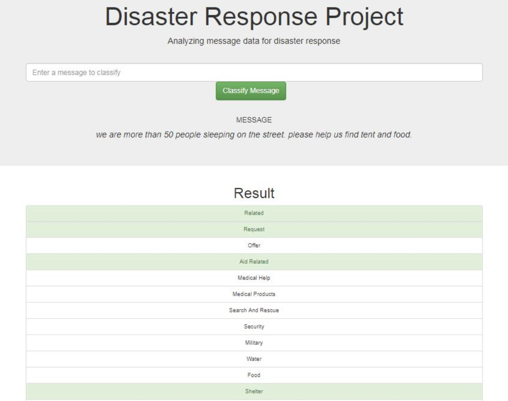
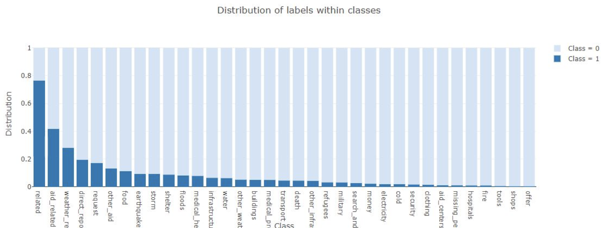
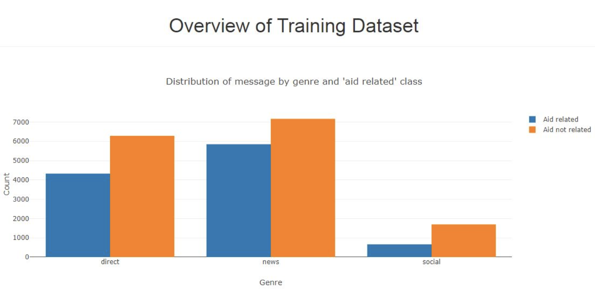

# Udacity-Disaster-Response-Project

## Description

This project is for the Data Engineering section in the Udacity Data Science Nanodegree program. The bassis of this project is to look at data provided by FigureEight. The data are tweets and texts that were sent during real world disasters and can be labeled into at least one of 36 categories. The project aim is to build a Natural Language Processing (NLP) model to categorize messages on a real time basis.

This project is divided in the following key sections:

1. Create ETL of data from CSV files and upload cleansed data to a database
2. Build a machine learning algorithm to analyze messages and optomize model classify the text message in various categories
3. Run a web app which can show model results in real time


## Getting Started

### Dependencies
* Python 3.5+

### Libraries 
1. NumPy 
2. SciPy 
3. Pandas
4. Sciki-Learn
5. NLTK 
6. SQLalchemy 
7. Pickle 
8. Flask 
9. Plotly

### Installation
To clone the git repository:
```
git clone https://github.com/HarshaKumarKS/udacity-disaster-response-pipeline.git
```

### Execution:
1. You can run the following commands in the project's directory to set up the database, train model and save the model.

    *  Run ETL pipleine by cleaning and storing the data into the DB

        - `python data/process_data.py data/disaster_messages.csv data/disaster_categories.csv data/disaster_response_db.db`

    * Run ML pipeline that loads data from DB, train and saves the classifier as a pickle file

       -  `python models/train_classifier.py data/disaster_response_db.db models/classifier.pkl`

2. Run the following command in the app's directory to run your web app.
   
   - `python run.py`

3. Go to http://0.0.0.0:3001/


### Important Files

**app/templates/**: templates/html files for web app

**data/process_data.py**: Extract Train Load (ETL) pipeline used for data cleaning, feature extraction, and storing data in a SQLite database

**models/train_classifier.py**: A machine learning pipeline that loads data, trains a model, and saves the trained model as a .pkl file for later use

**run.py**: This file can be used to launch the Flask web app used to classify disaster messages

<a name="authors"></a>
## Authors

* [Harsha Kumar](https://github.com/canaveensetia)

<a name="screenshots"></a>
## Web application screenshots








## Data observations

As can be seen from test data visualization most of the classes (categories) are highly imbalanced. This affects model F1 prediction score. One using this project should take this into consideration and apply measures like synthetic data generation, model selection and parameters fine-tuning, etc.

## License

This app was completed as part of the Udacity Data Scientist Nanodegree. Code templates and data were provided by Udacity. The data was originally sourced by Udacity from Figure Eight.